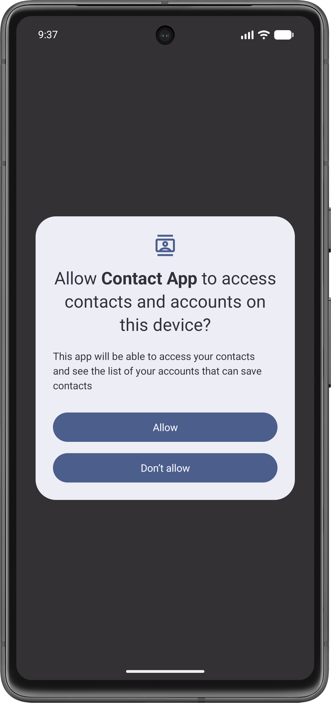
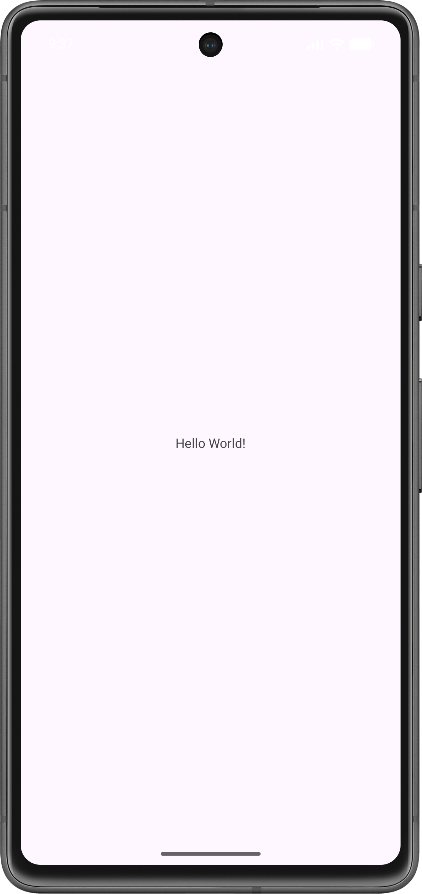

# Ex.No:3 Create Your Own Content Providers to get Contacts details.

## AIM:

To create your own content providers to get contacts details using Android Studio.

## EQUIPMENTS REQUIRED:

Android Studio(Min. required Artic Fox)

## ALGORITHM:

Step 1: Open Android Stdio and then click on File -> New -> New project.

Step 2: Then type the Application name as “ex.no.3″ and click Next.

Step 3: Then select the Minimum SDK as shown below and click Next.

Step 4: Then select the Empty Activity and click Next. Finally click Finish.

Step 5: Design layout in activity_main.xml.

Step 6: Get contacts details and Display details give in MainActivity file.

Step 7: Save and run the application.

## PROGRAM:

```
Program to print the text create your own content providers to get contacts details.
Developed by: Roopak C S
Registeration Number: 212223220088
```

### MainActivity.java

```java
package com.example.contactapp;

import android.Manifest;
import android.annotation.SuppressLint;
import android.content.pm.PackageManager;
import android.database.Cursor;
import android.os.Bundle;
import android.provider.ContactsContract;
import android.util.Log;
import android.widget.Toast;

import androidx.annotation.NonNull;
import androidx.appcompat.app.AppCompatActivity;
import androidx.core.app.ActivityCompat;
import androidx.core.content.ContextCompat;

public class MainActivity extends AppCompatActivity {

    private static final int PERMISSIONS_REQUEST_READ_CONTACTS = 100;
    private static final String TAG = "ContactLog";

    @Override
    protected void onCreate(Bundle savedInstanceState) {
        super.onCreate(savedInstanceState);
        setContentView(R.layout.activity_main);

        if (ContextCompat.checkSelfPermission(this, Manifest.permission.READ_CONTACTS)
                != PackageManager.PERMISSION_GRANTED) {

            ActivityCompat.requestPermissions(this,
                    new String[]{Manifest.permission.READ_CONTACTS},
                    PERMISSIONS_REQUEST_READ_CONTACTS);
        } else {
            loadContactsToLogcat();
        }
    }

    private void loadContactsToLogcat() {
        Cursor cursor = getContentResolver().query(
                ContactsContract.CommonDataKinds.Phone.CONTENT_URI,
                null,
                null,
                null,
                ContactsContract.CommonDataKinds.Phone.DISPLAY_NAME + " ASC"
        );

        if (cursor != null && cursor.getCount() > 0) {
            while (cursor.moveToNext()) {
                @SuppressLint("Range") String name = cursor.getString(
                        cursor.getColumnIndex(ContactsContract.CommonDataKinds.Phone.DISPLAY_NAME));
                @SuppressLint("Range") String phoneNumber = cursor.getString(
                        cursor.getColumnIndex(ContactsContract.CommonDataKinds.Phone.NUMBER));

                Log.d(TAG, "Name: " + name + " | Phone: " + phoneNumber);
            }
            cursor.close();
        }
    }

    @Override
    public void onRequestPermissionsResult(int requestCode, @NonNull String[] permissions, @NonNull int[] grantResults) {
        super.onRequestPermissionsResult(requestCode, permissions, grantResults);

        if (requestCode == PERMISSIONS_REQUEST_READ_CONTACTS) {
            if (grantResults.length > 0 && grantResults[0] == PackageManager.PERMISSION_GRANTED) {
                loadContactsToLogcat();
            } else {
                Toast.makeText(this, "Permission denied", Toast.LENGTH_LONG).show();
            }
        }
    }
}
```

### activity_main.xml

```xml
<?xml version="1.0" encoding="utf-8"?>
<androidx.constraintlayout.widget.ConstraintLayout xmlns:android="http://schemas.android.com/apk/res/android"
    xmlns:app="http://schemas.android.com/apk/res-auto"
    xmlns:tools="http://schemas.android.com/tools"
    android:id="@+id/main"
    android:layout_width="match_parent"
    android:layout_height="match_parent"
    tools:context=".MainActivity">

    <TextView
        android:layout_width="wrap_content"
        android:layout_height="wrap_content"
        android:text="Hello World!"
        app:layout_constraintBottom_toBottomOf="parent"
        app:layout_constraintEnd_toEndOf="parent"
        app:layout_constraintStart_toStartOf="parent"
        app:layout_constraintTop_toTopOf="parent" />

</androidx.constraintlayout.widget.ConstraintLayout>
```

### AndroidManifest.xml

```xml
<?xml version="1.0" encoding="utf-8"?>
<manifest xmlns:android="http://schemas.android.com/apk/res/android"
    xmlns:tools="http://schemas.android.com/tools">

    <uses-permission android:name="android.permission.READ_CONTACTS" />

    <application
        android:allowBackup="true"
        android:dataExtractionRules="@xml/data_extraction_rules"
        android:fullBackupContent="@xml/backup_rules"
        android:icon="@mipmap/ic_launcher"
        android:label="@string/app_name"
        android:roundIcon="@mipmap/ic_launcher_round"
        android:supportsRtl="true"
        android:theme="@style/Theme.ContactApp">
        <activity
            android:name=".MainActivity"
            android:exported="true">
            <intent-filter>
                <action android:name="android.intent.action.MAIN" />

                <category android:name="android.intent.category.LAUNCHER" />
            </intent-filter>
        </activity>
    </application>

</manifest>
```

## OUTPUT






## RESULT

Thus a Simple Android Application create your own content providers to get contacts details using Android Studio is developed and executed successfully.
